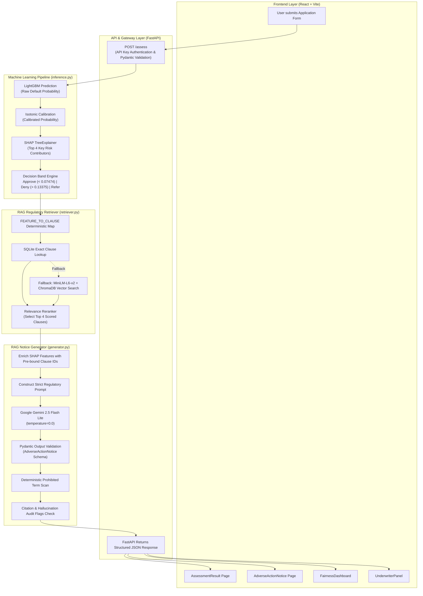
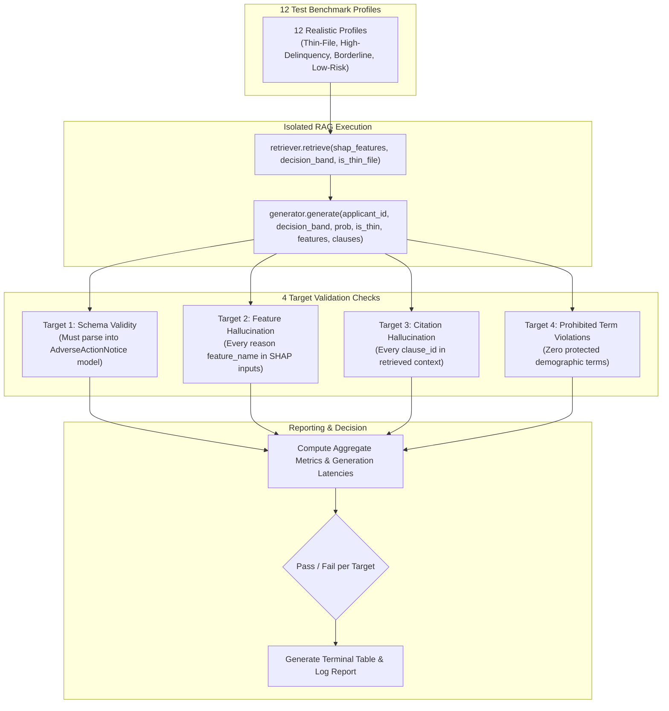

# FairTrace Architecture & Pipeline Specifications

This document outlines the detailed system architecture and evaluation workflows for the **FairTrace by Synchrony** platform.

---

## 1. End-to-End System Pipeline

The diagram below illustrates the complete end-to-end flow from applicant submission in the React UI through the machine learning and regulatory RAG pipelines to client rendering.

---

## 2. Standalone RAG Evaluation Harness Flow

The evaluation harness (`rag/eval_harness.py`) validates the regulatory RAG pipeline in complete isolation using a benchmark of 12 realistic credit profiles across four strict compliance dimensions.

