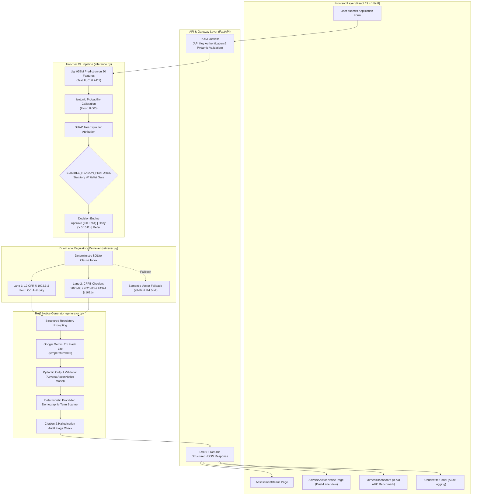
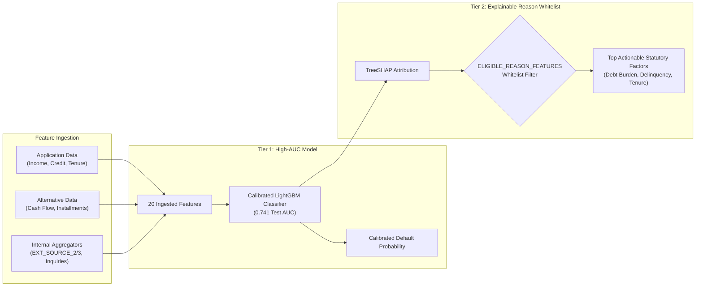

# FairTrace Architecture & System Specifications

This document details the system design, two-tier machine learning pipeline, and Dual-Lane regulatory RAG architecture of **FairTrace by Synchrony**.

---

## 1. End-to-End System Architecture

---

## 2. Dual-Lane Compliance Model

FairTrace solves the regulatory challenge of black-box AI by enforcing a two-lane statutory structure on every generated adverse action reason code:

### Lane 1: Substantive Factor Authorization
- **Statutory Authority**: **12 CFR § 1002.6(a), (b)(5), and (b)(6)**.
- **Form C-1 Checklist Alignment**: Regulation B Appendix C Sample Form C-1 line items (e.g., `Part I (Item 15): Delinquent past or present credit obligations with others`).
- **Legal Scope**: Explicit statutory boundary describing the creditor's legal authority to evaluate the specific risk factor.

### Lane 2: Procedural Specificity & AI Governance Mandate
- **Governing Directives**:
  - **12 CFR § 1002.9(b)(2)** & Official Staff Commentary: Requirement to state specific, principal reasons.
  - **CFPB Circular 2022-03**: Black-box algorithmic complexity does not exempt creditors from providing actionable, specific reasons.
  - **CFPB Circular 2023-03**: Prohibition against relying on generic checklist items when complex ML models score non-traditional factors.
  - **FCRA 15 U.S.C. § 1681m**: Consumer reporting agency disclosures and credit dispute rights.

---

## 3. Two-Tier Machine Learning Pipeline

---

## 4. Empirical Benchmark Validation (20 Test Profiles)

Across our 20-profile benchmark harness (`rag/eval_harness.py`):
- **Schema Validity**: 100.0% (20/20 Pydantic AdverseActionNotice instances validated)
- **Feature Hallucination Rate**: 0.0% (Zero ungrounded factors emitted)
- **Citation Hallucination Rate**: 0.0% (100% verified against SQLite regulatory index)
- **Prohibited Demographic Term Leakage**: 0.0% (0 ECOA violations)
- **Mean Retrieval Latency**: 0.20 seconds
- **Mean Generation Latency**: 4.38 seconds
